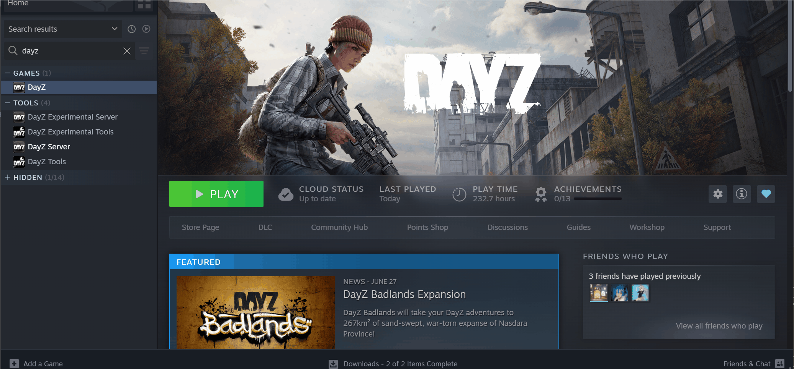
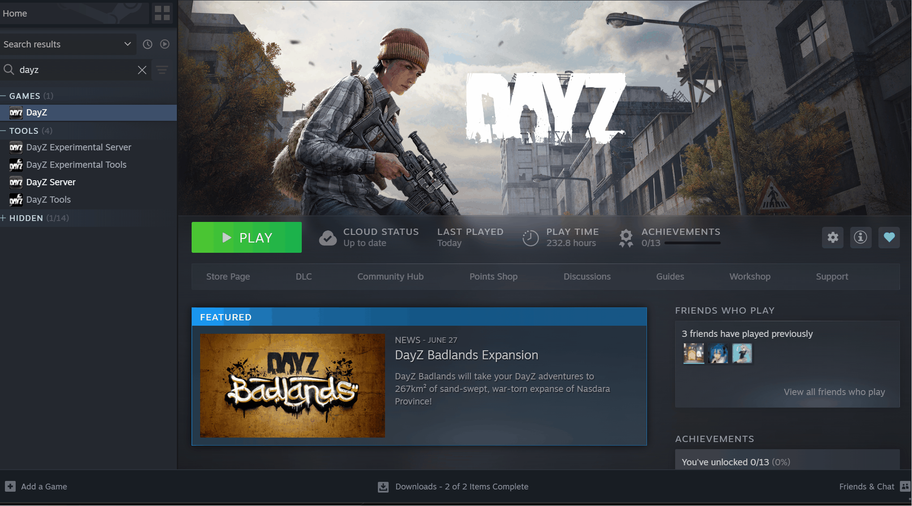
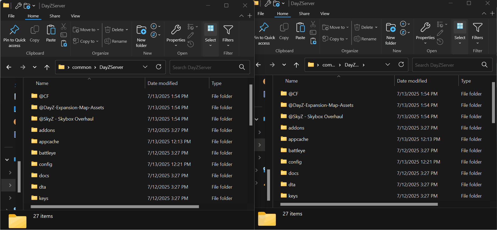
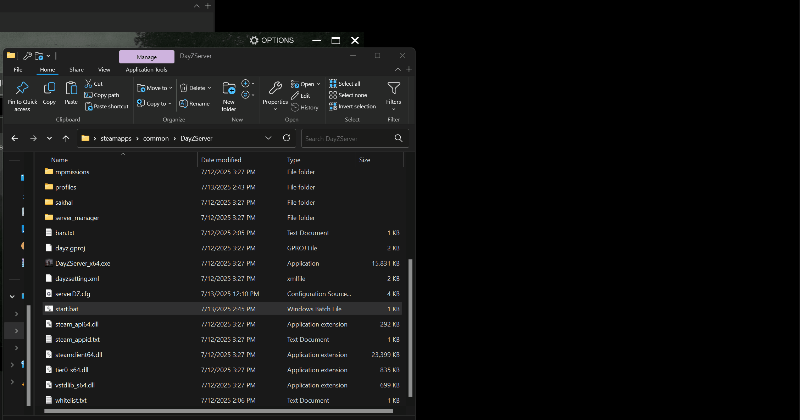

It is rare for people play vanilla DayZ, modding the game is somehow the **must have** to improve the gaming experience.
Good thing is we have [DayZ steam workshop](https://steamcommunity.com/app/221100/workshop/) to make modding easier. 

## **Downloading mods**
You can casually browse through the DayZ workshop and find whatever mods that interest you. 

Once download is finished, open the DayZ launcher your should find your installed mod in the mod section.

Go to your root folder of DayZ game (NOT DayZ Server!) > Click into `!Workshop` > copy all mods starting with `@`

Go to your DayZ Server root folder this time and paste these mods into DayZ Server root folder.

Click into each mod folder > find `*.bikey` file under `keys` > copy it > paste it into `keys` folder under `DayZ Server root`

Go edit the `start.bat` to add your mods to the server, separate your mods with a semicolon `;`, once is done remember to save the `start.bat`.

Start the server by Click `Start.bat` and you now should be good to go!

Test if your mod is successfully installed by joining the server. 

