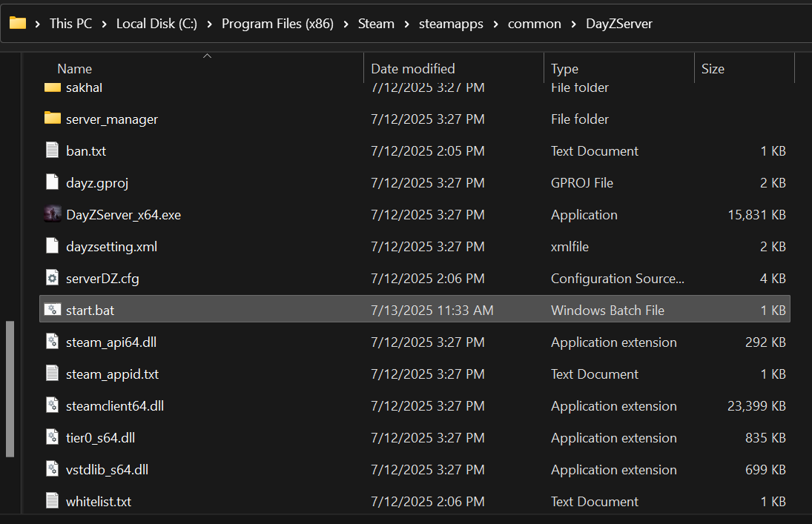

## **Windows**
> This is the easy path :sunny:

###  **Install the server**

Login in to your Steam > Click `Library` > Search `"DayZ Server"` > Click `Install`


Once download is completed, go Right Click `DayZ Server` > Click `Manage` > Click `Browse local files`. Your File Explorer should pop up with the path to your Dayz Server 


Default path should be `C:\Program Files (x86)\Steam\steamapps\common\DayZServer`

{width=300}

### **Preprae the .bat file**

The batch file is a popular way to lanuch the DayZ Server. Bohemia Interactive provide [explanation](https://community.bistudio.com/wiki/DayZ:Server_Configuration#Launch_Parameters) of the latest launch parameters 

```bat
@echo off
:start
:: User defined Parameters
::   Server files location (Change this if your are not using a default installation path for DayZ Server)
set SERVER_PATH="C:\Program Files (x86)\Steam\steamapps\common\DayZServer"
::   Server Port
set SERVER_PORT=2302
::   Server config
set SERVER_CONFIG=serverDZ.cfg
::   Logical CPU cores to use
set SERVER_CPU=2
::   Server profile name
set SERVER_PROFILE=profiles
::   Add mods in here 
set MODS=@mod1;@mod2

cd "%SERVER_PATH%"
echo Starting DayZ server...
::Launch parameters
start /wait "DayZ Server" "DayZServer_x64.exe" ^
    -config=%SERVER_CONFIG% ^
    -port=%SERVER_PORT% ^
    -profiles=%SERVER_PROFILE% ^
    -cpuCount=%SERVER_CPU% ^
    -mod=%MODS% ^
    -dologs ^
    -adminlog ^
    -netlog ^
    -freezecheck 

echo [WARN] Server exited or crashed. Restarting in 5 seconds...    
::Time in seconds before kill server process (5s)
timeout 5
::Go back and restart the server
goto start
```

You may copy this script to create `start.bat` by yourself or [Download](https://github.com/jldz9/dayz_tutorial/blob/main/start.bat) it on github page. 
Make sure to put it under your DayZServer root folder.



Double click on `start.bat` and you should see DayZ Server start and running, closing the server should lead to the batch file automatically restart the server. 


### **Server Configuration**
Once you make sure your server is runnable, it's time to config your server. Still, Bohemia Interactive provide [explanation](https://community.bistudio.com/wiki/DayZ:Server_Configuration) of the latest server config parameters. 

Open the ServerDZ.cfg in your DayZ Server root folder to config the server accordingly. and now you should able to start your server and login in your server now! 


You should able to find your own server under LAN section od  DayZ server browser and you should be able to login to your own server.


It's time to [mod your server](../modding/adding_mods.md) now!

## Linux 
> This is the hard path :skull:

Will add tutorial later